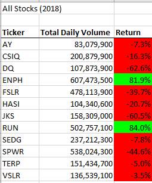

# Stock-Analysis

## Overview of Project
In this project, we are tasked with helping our friend Steve. He just graduated from college, and his parents are going to be his first clients for his new finance job. They are looking to specifically invest in green energy. Steve has gotten the data on a few green energy comapnies and wants us to simplify the data to display the performance of the companies' stocks in 2017 and in 2018. In addition to this, he would like us to refactor a VBA script so that it runs the analysis quicker than before. 

## Results

### Analysis of Stock Performance in 2017

### Analysis of Stock Performance in 2018

### Summary 

