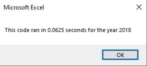

# Stock-Analysis

## Overview of Project
In this project, we are tasked with helping our friend Steve. He just graduated from college, and his parents are going to be his first clients for his new finance job. They are looking to specifically invest in green energy. Steve has gotten the data on a few green energy comapnies and wants us to simplify the data to display the performance of the companies' stocks in 2017 and in 2018. In addition to this, he would like us to refactor a VBA script so that it runs the analysis quicker than before. 

## Results

### Analysis of Stock Performance in 2017

### Analysis of Stock Performance in 2018

*It looks very clear that performance in 2017 was much better than 2018. Only one stock in 2017 had negative returns for the year, while  10 stocks showed negative returns in 2018. Based on the performances of the stocks, I would advise Steve that DQ is actually not the best performer. It appears that the best performer over the 2 year span was ENPH. The ENPH increased 129.5% in 2017 and 81.9% in 2018. 

## Advantages and Disadvantages of Refactoring Code
Refactoring code is an essential part of data analytics. Rather than creating code, we are modifying code to make it more efficent. One advanatge of refactoring (as in this example) is making our programs run quicker. As with everything, refactoring has its disadvantages too. I would say that one of the biggest disadvantages of refactoring code is by working on a code that already works, we could be introducing new bugs and errors into a code that already worked fine.

This also applys to this project. The original script was able to do exactly what the new script did; it was a matter of saving time if more data were to be introduced. The new script is based off a hypothetical situation if we wanted to introduce more data. Therefore, I would argue that the disadvantages of the new script is that it seems a solution that wasn't really needed for this problem. The advantage of this new script would be that it runs quicker and would operate more efficiently than the old script if more data were to be introduced. 

