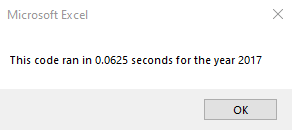

# Stock-Analysis

## Overview of Project
In this project, we were given data by Louise. Louise is working on his own play, titled Fever, and would like us to analyze the data he provided to us about other kickstarter projects to see how they performed in certain categories.

## Results

### Analysis of Outcomes Based on Launch Date

*Based on the graph created above, Louise should most likely launch his kickstarter in either May, June, or July. The worst month appears to be December, where the number of successful and failed campaigns are almost equal.

### Analysis of Outcomes Based on Goals

*This graph provides us data about how successful campaigns were based on their monetary goal. We see that the categories of "Less than $1000" and "$1000 to $4999" appear to have the highest success rates.

### Summary 

